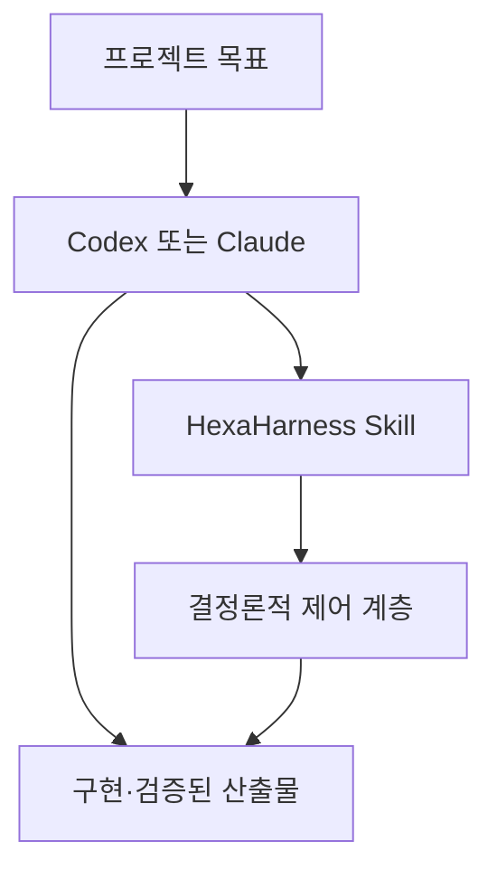

# HexaHarness

[English](README.md) | 한국어

HexaHarness는 Codex와 Claude Code를 위한 에이전트 우선(agent-first) 프로덕션 작업 하네스입니다. 사용자는
자연어로 프로젝트 목표를 전달하고, 호스트 에이전트는 Skill을 선택해 설계·구현·검증을 수행하며
재개 가능한 상태를 관리합니다. 결정론적 `hexa` 런타임은 Skill 뒤에서 정책 검사, 제한된 실행,
체크포인트, 자동 검증 증거, 실패 학습을 담당합니다.

**HexaHarness는 Skill이며, 플러그인으로 배포하고, 내부에서 CLI를 사용합니다.** 사용자는 Codex나
Claude에 작업을 요청하고 에이전트가 런타임을 운영합니다. 플러그인에 Skill과 런타임이 함께 들어 있어
`hexa`를 별도로 설치할 필요가 없습니다.



## 에이전트가 담당하는 일

- 요구사항을 파악하고 동작, 아키텍처, 범위, 비용 또는 비가역적 결과에 실질적인 영향을 주는
  결정만 질문합니다.
- 인수 기준을 정하고, 나중에도 필요한 주요 설계 결정은 저장소의 기존 문서 규칙에 맞춰 남깁니다.
- 구현, 테스트, 실패 원인 수정, 의미 있는 마일스톤 체크포인트를 수행합니다.
- 사용자가 task ID를 관리하지 않아도 중단된 작업을 이어갑니다.
- 프로덕션 준비 상태를 점검하고 실제 실패를 더 강한 가이드·센서·권한·런타임 통제로 전환합니다.
- 외부 상태를 변경하거나 되돌리기 어려운 작업을 준비하고, 정확한 승인이 없을 때만 질문합니다.

## 한 번만 설치하기

요구 사항은 Python 3.12+와 Codex CLI 또는 Claude Code입니다. 최초 사용 시 런처가 버전과 해시가
고정된 Python 의존성을 비공개 캐시에 자동 설치합니다. 일반적으로 사용자 캐시를 사용하며, 사용할
수 없으면 사용자 전용 임시 캐시나 프로젝트의 `.hexaharness/runtime/`으로 대체합니다. 사전 구성된
환경이 없다면 최초 실행에는 네트워크 접근이 필요합니다.

마켓플레이스에서 플러그인 전체를 설치해야 합니다. `skills/hexaharness/` 디렉터리만 복사하는 방식은
지원하지 않습니다. Skill이 플러그인 루트의 `src/` 패키지와 `runtime-requirements.txt` lock 파일을
의도적으로 함께 사용하기 때문입니다.

### Codex

```bash
codex plugin marketplace add seungbinshin/hexaharness
codex plugin add hexaharness@hexaharness
```

설치 후 프로젝트에서 새 Codex 대화를 시작합니다. 주 Skill은 소프트웨어 수명주기 작업에서 자동
선택될 수 있도록 설정되어 있습니다. 반드시 선택해야 할 때는
`$hexaharness:hexaharness`를 명시적으로 사용할 수 있습니다.

### Claude Code

```bash
claude plugin marketplace add seungbinshin/hexaharness
claude plugin install hexaharness@hexaharness
```

설치 후 새 Claude Code 세션을 시작합니다. Claude는 설명을 바탕으로 Skill을 자동 선택할 수 있으며,
필요하면 `/hexaharness:hexaharness`로 명시적으로 호출할 수 있습니다. 현재 소스 체크아웃을 바로 시험하려면
이 저장소에서 `claude --plugin-dir .`을 실행합니다.

## 자연어로 사용하기

일반 사용에서는 사용자가 HexaHarness 명령을 직접 실행할 필요가 없습니다. 예를 들면 다음과 같이 요청합니다.

```text
이 API 워크플로를 자동화하는 프로덕션 수준 CLI를 설계하고 구현해 줘.
되돌릴 수 있는 세부 사항은 저장소에서 추론하고, 중요한 제품 결정만 질문해.
외부에 게시하기 직전에는 멈춰 줘.
```

나중에 이어서 요청할 수도 있습니다.

```text
우선순위가 가장 높은 미완료 작업을 이어서 검증하고 릴리스 준비까지 해 줘.
```

Skill 선택은 호스트 모델이 수행합니다. 폭넓은 수명주기 메타데이터를 통해 관련 프로젝트 작업에서
자동 선택 대상이 되며, 호스트가 선택하지 않은 경우에는 명시적 호출을 사용할 수 있습니다.

## 자율 실행과 승인 경계

아래 표는 Skill이 따르는 기본 운영 원칙입니다. 결정론적 런타임은 자신을 통해 실행된 명령을 설정된
인자 prefix와 경로 규칙으로 검사하며, 허용된 도구 내부의 모든 의미적 부작용까지 판별하지는 못합니다.
호스트 샌드박스와 승인 정책은 항상 함께 적용됩니다.

| 작업 | 기본 동작 |
|---|---|
| 저장소 검사와 되돌릴 수 있는 세부 사항 추론 | 추가 승인 없이 진행 |
| 프로젝트 파일 편집, 의존성 해결, 포맷, 빌드, 린트, 타입 검사, 테스트 | 호스트 권한 범위에서 추가 승인 없이 진행 |
| 체크포인트와 필요한 로컬 Git 커밋 생성 | 추가 승인 없이 진행 |
| push, publish, release, deploy 또는 외부 서비스 변경 | 정확한 작업·대상의 승인을 확인하고, 없을 때만 요청 |
| 중요한 데이터 삭제, 공유 권한 변경, 메시지 전송 또는 결제 | 정확한 승인과 호스트 권한 필요 |
| `ask` 규칙 또는 외부·비가역 작업으로 식별 | 정확한 명령과 대상을 사람에게 승인받은 뒤 진행 |
| 미등록 명령 발견 | 정확한 인자와 코드를 검사하고, 이미 요청 범위에 속하는 로컬·가역 작업일 때만 진행 |
| 명시적인 `deny` 규칙과 일치 | 중단하며 승인 플래그로 우회하지 않음 |

호스트의 샌드박스, 네트워크 정책, 승인 체계가 항상 우선합니다. `--approved`는 정확한 `ask` 작업이
이미 사람에게 승인되었다는 감사용 표식일 뿐이며, 승인을 얻거나 추론하는 수단이 아닙니다.
`--reviewed`는 미등록 로컬 명령을 에이전트가 검사했음을 기록하며 외부 작업이나 되돌리기 어려운
작업을 승인할 수 없습니다.

정확한 작업과 대상에 대해 이미 받은 승인은 체크포인트가 바뀌어도 유효합니다. 승인이 거절되면
에이전트가 준비된 작업을 취소하고 사유를 기록합니다. 승인 대기 시간은 실행 시간 예산에서 제외하며,
사용자가 내부 상태를 복구하거나 task ID를 정리할 필요가 없습니다.

## 프로젝트 수명주기

1. **발견** — 프로젝트 지침, 코드, 테스트, 이력, 활성 체크포인트를 확인합니다.
2. **설계** — 최소 릴리스 범위, 관측 가능한 인수 기준, 중요한 아키텍처 결정, 기술 스택과 정확한
   검증 명령을 정의합니다. 빈 저장소에서는 먼저 해당 스택을 구성한 뒤 하네스를 초기화하며,
   임시 `Unknown`/`false` 센서는 거부합니다.
3. **구현** — 일관된 로컬 변경을 만들고 마일스톤마다 체크포인트를 남깁니다.
4. **검증** — 실패한 로컬 검사를 자율적으로 수정하고, 완료 시 필수 센서를 통과시킵니다.
   판단이 필요한 중요한 질문이 남을 때 독립 검토를 추가합니다.
5. **관리** — 재개 가능한 상태를 보존하고 실제 실패를 영구적인 통제로 강화합니다.
6. **릴리스 경계** — 작업을 활성 상태로 유지한 채 검증하고 외부 작업을 작업별 1회용 표식으로
   준비한 다음, 그 정확한 작업을 승인받아 한 번 실행하고 외부 상태까지 검증한 뒤 완료 처리합니다.

구현은 실제 프로젝트 파일 변경으로, 리뷰는 검토 결과 보고서로, 게시만 하는 작업은 외부 결과를
확인한 기록으로 완료할 수 있습니다. 에이전트가 작업 유형을 선택하므로 리뷰나 게시를 끝내기 위해
불필요하게 코드를 수정하지 않습니다. 일반적인 로컬 검사 실패는 수정 가능한 활성 상태로 유지하되,
반복 실패·시간 초과·예산 소진 시에는 증거를 보존하고 중단합니다.

## 여섯 계층

| 계층 | HexaHarness가 제공하는 것 |
|---|---|
| 가이드 | 정확한 프로젝트 명령과 실제 실패에서 도출해 날짜가 기록된 규칙 |
| 센서(자동 검증기) | 셸을 사용하지 않는 build, lint, type, test, schema 명령 실행 |
| 에이전트 실행 루프 | 제한된 재시도, 시간 제한, 중단 조건, 에스컬레이션 패킷 |
| 작업 메모리 | 원자적으로 저장되는 작업 체크포인트, 산출물 포인터, 재시작 복구 |
| 권한 정책 | 명령과 경로에 대한 `allow/ask/deny` 결정 |
| 관측성 | JSONL 이벤트, 보존된 명령 출력, 감사, 중단 트리거 |

## 내부 런타임

Skill은 `skills/hexaharness/scripts/hexa.py`를 호출합니다. 이 표준 라이브러리 전용 런처는
비공개 캐시에 버전별 가상 환경을 만들고 해시가 고정된 `runtime-requirements.txt`를 설치한 다음,
격리된 모듈 로더로 내장 `src/hexaharness` 패키지를 셸 없이 실행합니다. 의존성 lock이나 플랫폼이
바뀌면 새 캐시 키를 만들고, 호스트에서 플러그인을 업데이트하면 별도 CLI 재설치 없이 새 플러그인
소스를 사용합니다.

운영자는 `HEXAHARNESS_CACHE_DIR`로 캐시 위치를 바꾸거나 `HEXAHARNESS_RUNTIME_PYTHON`으로 필요한
의존성이 이미 설치된 호환 Python 인터프리터를 선택할 수 있습니다. 두 변수 모두 선택 사항이며
일반적인 Agent 사용에는 필요하지 않습니다.

## 운영자와 CI를 위한 직접 CLI 사용

CLI는 디버깅, CI, 저수준 진단에 계속 사용할 수 있습니다.

```bash
python3 -I skills/hexaharness/scripts/hexa.py --help
```

개발자는 `uv tool install .`로 일반적인 방식의 CLI 설치도 할 수 있습니다.

CLI를 직접 사용하는 운영자는 각 산출물 쓰기 직전에
`hexa policy-check --task-id <task-id> --path <path> --write`를 실행해야 합니다. 이때 저장되는
쓰기 전 관찰값을 통해 완료 검증은 파일 시간에 의존하지 않고 해당 작업의 실제 내용 변경 또는 새
파일 생성을 증명합니다.

| 명령 | 용도 |
|---|---|
| `hexa init` | 정확한 프로젝트 프로필을 감지하거나 전달받은 뒤 여섯 계층 설정 생성 |
| `hexa doctor` | 설정의 의미적 준비 상태 검증과 활성 센서 목록 출력 |
| `hexa start` | 변경·리뷰·릴리스 유형의 복구 가능한 task 생성 |
| `hexa checkpoint` | 마일스톤, 산출물, 호스트가 보고한 사용량 기록 |
| `hexa policy-check` | 실행 없이 명령 또는 경로를 평가하고 허용된 task 쓰기의 변경 전 내용을 결합 |
| `hexa prepare-external` | 사람에게 승인받기 전에 정확한 외부 작업을 작업별 1회용 표식으로 준비 |
| `hexa run` | 에이전트 검토와 사람 승인을 구분해 정책이 적용된 인자 목록(`argv`)을 셸 없이 실행 |
| `hexa verify` | 계산 가능한 센서를 실행하고 증거 보존 |
| `hexa complete` | 완료 상태로 전환하기 전에 센서 통과 요구 |
| `hexa resume` | 체크포인트 복구 또는 명시적 재활성화 |
| `hexa learn` | 관측된 실패를 추적 가능한 개선으로 전환 |
| `hexa audit` | 12개 항목의 프로덕션 준비 상태 검사 |
| `hexa stop` | task 중단 또는 프로젝트 비상 정지 활성화 |
| `hexa prune` | 보존 정책에 따라 만료된 런타임 증거 정리를 미리 보거나 적용 |

## 보안 경계

HexaHarness는 자체 런타임을 통해 실행되는 명령을 통제하지만 호스트 운영체제의 샌드박스를 대체하지
않습니다. 명령은 셸 문자열이 아닌 인자 목록(`argv`)으로 실행됩니다. 런타임 로그와 산출물은
`.hexaharness/` 아래의 Git 제외 런타임 디렉터리에 저장됩니다. 반면 하네스 설정과 실패 기반 가이드는
Git으로 추적됩니다. 추적된 프로젝트 가이드와 설정은 신뢰된 지침입니다. 웹 페이지, 이슈, 검색해
가져온 문서, 명령 출력과 사용자가 제공한 데이터 콘텐츠는 그 자체로 권한이나 예산을 확대할 수
없습니다. 사용자의 명시적 요청과 정확한 작업별 승인은 별도의 권한 부여로 취급합니다.

외부 작업은 미리 준비한 정확한 명령에 결합해 한 번 실행합니다. 중단되거나 결과가 불확실하면
에이전트가 외부 시스템을 먼저 확인한 뒤 재시도 여부를 판단합니다. 내부 승인·복구 절차는 운영 가이드에
설명되어 있습니다.

[아키텍처](docs/architecture.md), [운영 가이드](docs/operations.md),
[보안 정책](SECURITY.md)을 참고하세요.

## 개발 및 검증

```bash
uv sync --locked
uv run ruff format --check .
uv run ruff check .
uv run mypy src skills/hexaharness/scripts/hexa.py
uv run pytest --cov
uv build
```

Skill 변경에는 Skill validator가 필요하며, 플러그인 변경 시 두 생태계의 manifest 버전을 동기화해야
합니다. MIT License로 배포됩니다.
