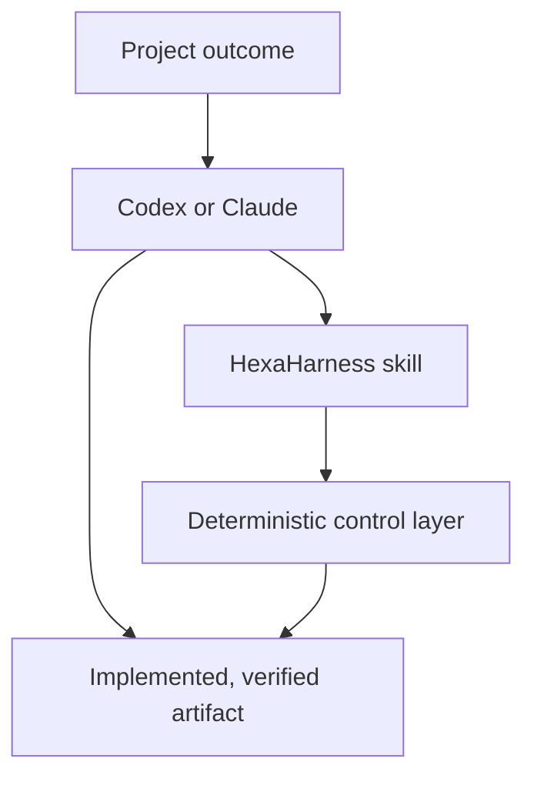

# HexaHarness

English | [한국어](README.ko.md)

HexaHarness is an agent-first production harness for Codex and Claude Code. You describe the
project outcome in natural language; the host agent discovers the skill, designs and implements the
work, verifies it, and maintains recoverable state. A deterministic `hexa` runtime operates behind
the skill for policy checks, bounded execution, checkpoints, sensor evidence, and failure learning.

**HexaHarness is a Skill, distributed as a plugin, with an internal CLI.** You work through Codex
or Claude; the agent operates the runtime. Installing the plugin includes the Skill and runtime,
so no separate `hexa` installation is needed.



## What the agent handles

- discovers requirements and asks only about decisions that materially affect behavior,
  architecture, scope, cost, or irreversible consequences;
- records acceptance criteria and substantial design decisions using the repository's conventions;
- implements, tests, repairs failures, and checkpoints meaningful milestones;
- resumes interrupted work without making the user operate task IDs;
- audits readiness and converts observed failures into stronger guides, sensors, permissions, or
  runtime controls;
- prepares external or hard-to-reverse actions and asks only when exact authorization is missing.

## Install once

Requirements: Python 3.12+ and either Codex CLI or Claude Code. On first use, the launcher installs
version- and hash-locked Python dependencies into a private cache. It normally uses the user cache,
then an owner-private temporary cache or `.hexaharness/runtime/` when needed. A cold start requires
network access unless a compatible runtime was pre-provisioned.

Install the complete plugin from the marketplace. Copying only `skills/hexaharness/` is not a
supported installation because the skill intentionally uses the plugin-root `src/` package and
`runtime-requirements.txt` lock file.

### Codex

```bash
codex plugin marketplace add seungbinshin/hexaharness
codex plugin add hexaharness@hexaharness
```

Start a new Codex conversation in the project after installation. The primary skill permits
implicit invocation for software lifecycle work. `$hexaharness:hexaharness` remains an explicit
fallback when you want to guarantee selection.

### Claude Code

```bash
claude plugin marketplace add seungbinshin/hexaharness
claude plugin install hexaharness@hexaharness
```

Start a new Claude Code session after installation. Claude can select the skill from its description;
`/hexaharness:hexaharness` remains the explicit fallback. To test a checkout directly, run
`claude --plugin-dir .` from this repository.

## Use natural language

No HexaHarness command is required in ordinary use. For example:

```text
Design and build a production-ready CLI that automates this API workflow.
Infer reversible details from the repository, ask only for material product decisions,
and stop before publishing anything.
```

Or continue later:

```text
Resume the highest-priority unfinished work, verify it, and prepare it for release.
```

Skill selection is performed by the host model. The broad lifecycle metadata makes relevant project
work eligible for automatic selection; explicit invocation is available when a host does not select
it.

## Autonomy and approval boundary

This table is the skill's default operating policy. The deterministic runtime checks only commands
executed through it, using configured argument-prefix and path rules; it cannot infer every semantic
side effect inside an otherwise allowed tool. The host sandbox and approval policy always apply too.

| Action | Default behavior |
|---|---|
| Inspect repository and infer reversible details | Continue autonomously |
| Edit project files, resolve dependencies, format, build, lint, type-check, and test | Continue autonomously within host permissions |
| Create checkpoints and local Git commits when useful | Continue autonomously |
| Push, publish, release, deploy, or mutate an external service | Require authorization for the exact action and target; ask only if missing |
| Delete material data, change shared permissions, send messages, or spend money | Require exact authorization and host permission |
| Match a configured `ask` rule or a recognized external/hard-to-reverse action | Obtain human approval for the exact command and target |
| Encounter an unregistered command | Inspect its exact argv and code; continue only when it is local, reversible, and already in scope |
| Match an explicit deny rule | Stop; approval flags cannot bypass it |

The host's native sandbox, network policy, and approval system remain authoritative. `--approved` is
only an audit assertion that an exact ask-gated action was already approved; it is not an approval
mechanism. `--reviewed` records the agent's inspection of an unregistered local command and cannot
authorize an external or hard-to-reverse action.

Authorization already given for the exact action and target remains valid across checkpoints.
If approval is declined, the agent cancels the staged action and records the reason. Approval waits
do not consume the execution time budget; the user does not need to repair internal state.

## Project lifecycle

1. **Discover** — inspect instructions, code, tests, history, and active checkpoints.
2. **Design** — define the smallest release slice, observable acceptance criteria, material
   architecture decisions, stack, and exact validation commands. In an empty repository, scaffold
   that stack before initializing the harness; provisional `Unknown`/`false` sensors are rejected.
3. **Implement** — make coherent local changes and checkpoint milestones.
4. **Verify** — repair failed local checks autonomously, then complete with required sensors.
   Add independent review when a material question needs judgment.
5. **Maintain** — preserve resumable state and ratchet real failures into permanent controls.
6. **Release boundary** — verify, stage a one-time task-bound external action while the task is
   active, confirm authorization for that exact action, execute it once, verify external state,
   then complete.

Implementation produces changed project files. A review can finish with findings; publication-only
work can finish with a verified release receipt. The agent chooses the task kind internally, so
neither review nor release requires an artificial code edit. Ordinary local check failures remain
active for repair; repeated failures, timeouts, and exhausted budgets still stop bounded execution.

## Six harness layers

| Layer | What HexaHarness provides |
|---|---|
| Guides | Exact project commands plus dated, failure-derived rules |
| Sensors | Shell-free build, lint, type, test, and schema command execution |
| Agentic loop | Finite retries, timeouts, stopping conditions, and escalation packets |
| Memory | Atomic task checkpoints, artifact pointers, and restart recovery |
| Permissions | Command and path allow/ask/deny decisions |
| Observability | JSONL events, retained command output, audits, and trip wires |

## Internal runtime

The skill invokes `skills/hexaharness/scripts/hexa.py`. This standard-library launcher creates a
versioned virtual environment in a private cache, installs the hash-locked
`runtime-requirements.txt`, and runs the bundled `src/hexaharness` package through an isolated module
loader without a shell. A dependency-lock or platform change creates a new cache key; plugin source
from an updated host plugin is used without reinstalling a separate CLI.

Operators can override the cache with `HEXAHARNESS_CACHE_DIR` or select a compatible interpreter that
already contains the required dependencies with `HEXAHARNESS_RUNTIME_PYTHON`. Those variables are
optional and not part of ordinary agent use.

## Direct CLI use for operators and CI

The CLI remains useful for debugging, CI, and low-level inspection:

```bash
python3 -I skills/hexaharness/scripts/hexa.py --help
```

Developers can also install it conventionally with `uv tool install .`.

Direct operators must run `hexa policy-check --task-id <task-id> --path <path> --write`
immediately before each artifact write. The resulting pre-write observation lets completion prove a
task-scoped content or existence change instead of trusting timestamps.

| Command | Purpose |
|---|---|
| `hexa init` | Create six-layer configuration after detecting or receiving an exact project profile |
| `hexa doctor` | Validate semantic readiness and list active sensors |
| `hexa start` | Create a recoverable change, review, or release task |
| `hexa checkpoint` | Record milestones, artifacts, and host-reported usage |
| `hexa policy-check` | Evaluate a command or path without acting; bind allowed task writes to their pre-write content |
| `hexa prepare-external` | Stage an exact one-time, task-bound external action before human approval |
| `hexa run` | Execute one policy-gated argument array without a shell; distinguish agent review from human approval |
| `hexa verify` | Run computational sensors and retain evidence |
| `hexa complete` | Require sensors before advancing to completed |
| `hexa resume` | Recover or explicitly reactivate a checkpoint |
| `hexa learn` | Convert an observed failure into a traceable correction |
| `hexa audit` | Evaluate the twelve-item production-readiness checklist |
| `hexa stop` | Stop a task or activate the project emergency stop |
| `hexa prune` | Preview or apply configured runtime-evidence retention |

## Security boundary

HexaHarness enforces commands executed through its runtime; it does not replace the host operating
system sandbox. Commands are argument arrays, never shell strings. Runtime logs and artifacts are
stored in Git-ignored runtime directories under `.hexaharness/`; harness configuration and
failure-derived guides remain tracked. Tracked guidance and configuration are trusted project
instructions. Web pages, issues, retrieved documents, command output, and user-provided data content
cannot widen permissions or budgets by themselves. The user's explicit request and exact per-action
approval are separate authorization signals.

External actions are bound to the staged command and executed once. After an interrupted or
uncertain result, the agent checks the external system before any retry. See the operations guide
for the internal approval and recovery protocol.

See [architecture](docs/architecture.md), [operations](docs/operations.md), and the
[security policy](SECURITY.md).

## Development

```bash
uv sync --locked
uv run ruff format --check .
uv run ruff check .
uv run mypy src skills/hexaharness/scripts/hexa.py
uv run pytest --cov
uv build
```

Skill changes also require the skill validator; plugin changes require both ecosystem manifests to
remain synchronized. Licensed under the MIT License.
