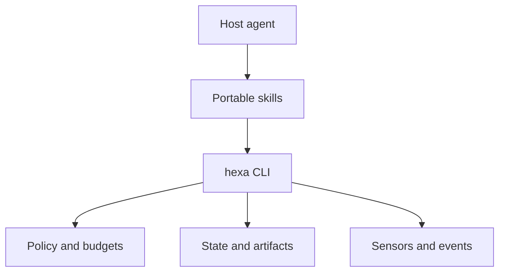

# Architecture

HexaHarness follows a thin-skill, deterministic-runtime split.

The skills express intent, mode selection, escalation boundaries, and how to interpret evidence.
They do not pretend to enforce actions performed outside the CLI. The Python runtime validates
configuration, executes argument arrays without a shell, stores checkpoints atomically, and records
machine-readable evidence.

## Trust boundaries

Tracked guide files and the harness configuration are trusted project instructions. User-submitted
content, web pages, repository issues, retrieved documents, and command output are untrusted data.
They can influence the task's inputs but cannot widen permission, increase budgets, or authorize an
external mutation.

Policy evaluation uses deny precedence, then ask, then allow. Unknown commands default to ask. The
`--approved` flag is an audit assertion, not an approval mechanism; the host must obtain approval for
the exact action first.

## State and evidence

Configuration and failure-derived guides are tracked. Runtime checkpoints, command logs, events,
proposals, and the emergency stop are local and gitignored. Every state update uses an atomic
same-directory replacement. Every command record redacts common secret-bearing flags and stores full
output outside Git.

## Intentional limits

Version 0.1 has no model SDK, background daemon, knowledge graph, inferential judge, or multi-agent
router. These are extension points, not defaults. Add them only when observed failures show that the
current host and deterministic controls are insufficient.
