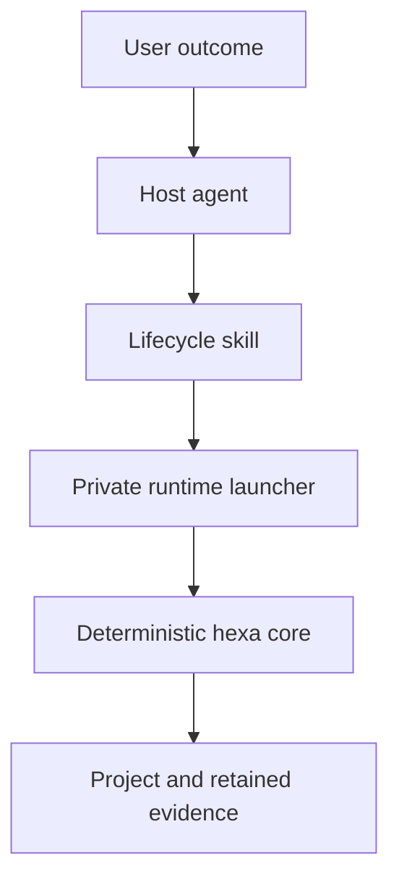

# Architecture

HexaHarness uses an agent-first, deterministic-runtime split. The plugin is the distribution unit;
the CLI is an internal control plane that remains directly usable by operators and CI.

## Responsibility boundary

| Component | Owns | Does not own |
|---|---|---|
| Host agent | Requirement discovery, design judgment, edits, causal repair, communication | Deterministic policy or evidence claims |
| Lifecycle skill | Mode selection, autonomy boundary, orchestration, interpretation of evidence | Operating-system enforcement |
| Runtime launcher | First-use dependency bootstrap and version-isolated execution | Project decisions or approval |
| `hexa` core | Policy decisions, bounded argv execution, checkpoints, sensors, events, audits | Model reasoning or actions bypassing the core |
| Host sandbox | Filesystem, network, credential, and process authority | Project-specific acceptance criteria |

## Runtime resolution

`skills/hexaharness/scripts/hexa.py` is standard-library-only. It hashes the exact pinned runtime
requirements with the Python ABI and platform, prepares one virtual environment under the user
cache, and loads the current plugin's trusted `src/` tree with an isolated constant module loader.
The dependency environment is reused until its lock changes, while plugin source updates take effect
without reinstalling a wheel.

The launcher never resolves a `hexa` executable from `PATH`, avoiding version skew with a separately
installed CLI. Isolated mode removes the caller's working directory, `PYTHONPATH`, user site, and
`PYTHONHOME` from module resolution before the trusted source path is inserted. The skill invokes
the launcher with Python's `-I` isolation flag; the launcher then invokes the core with argument
arrays, not shell strings.

## Trust and approval boundaries

Tracked guide files and harness configuration are trusted project instructions. User-submitted
content, web pages, repository issues, retrieved documents, and command output are untrusted data.
They can influence inputs but cannot widen permissions, increase budgets, or authorize an external
mutation.

Policy evaluation uses deny precedence, then ask, then allow. Project-local reversible work is
allowed by the default profile. External publication and service mutations require human approval,
while known destructive commands are denied. Unknown commands enter an agent-review boundary:
`--reviewed` records inspection of exact argv and implementation but cannot authorize external or
hard-to-reverse work. The `--approved` flag is an audit assertion, not an approval mechanism; the
host must obtain approval for the exact action first.

The skill routes material project commands through the core and policy-checks host file-write
targets. The host sandbox remains the actual process and filesystem boundary: HexaHarness can record
and classify compliant host actions, but it cannot intercept a host tool that ignores the skill.

## State and evidence

Configuration and failure-derived guides are tracked. Runtime checkpoints, command logs, events,
proposals, and the emergency stop are local and Git-ignored. Every state update uses an atomic
same-directory replacement. Task-start events fingerprint the active configuration and guide files;
task-scoped pre-write observations bind artifacts to content or existence deltas, and checkpoint
events fingerprint regular artifact files. Every command record redacts common
secret-bearing flags and stores full output outside Git. Human-gated actions use a redacted display,
one-time nonce, and local-key HMAC of the task ID, protocol phase, and full argv. This prevents a
secret-bearing argument, task, or phase from changing after approval without exposing an unkeyed
secret digest in retained evidence. Failure-learning records accept only stable retained output
bytes bound to actual runtime failure events; dry-run policy checks cannot manufacture maturity.

Durable product plans and architecture decisions stay in the repository's existing documentation
convention. HexaHarness checkpoints point to those artifacts instead of creating a second project
management system.

## Intentional limits

Version 0.2 has no model SDK, background daemon, knowledge graph, inferential judge, or multi-agent
router. When a host supplies subagents, the skill uses typed artifact/evidence handoffs and separates
producer from reviewer, while the shared checkpoint remains authoritative. The host agent supplies
intelligence and routing; HexaHarness supplies reusable operating discipline and deterministic
controls. Add another runtime layer only when observed failures show that the current split is
insufficient.
