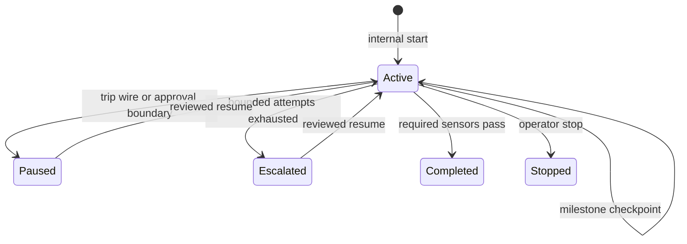

# Operations

## Agent-managed lifecycle

The user normally supplies an outcome, not commands. The skill starts or resumes the matching task,
retains the task ID internally, checkpoints meaningful milestones, and runs required sensors. It
does not checkpoint every edit or expose routine JSON bookkeeping.

For material work, the skill routes project commands through `hexa run` and checks intended write
targets with `hexa policy-check` before using a host edit tool. Read-only discovery and harness
control commands can remain direct. This keeps routine policy and evidence collection internal; it
does not ask the user to operate the CLI.

`hexa complete` is the only ordinary path to `completed`; it reruns required sensors. If a requested
external action remains, the skill keeps the task active, stages the exact action, obtains approval,
runs and verifies it, and only then completes. Do not run a duplicate full sensor suite immediately
before `complete` unless intermediate verification or a pre-publication gate requires it.

Choose `hexa start --kind change|review|release` internally:

| Kind | Completion evidence |
|---|---|
| `change` (default) | A changed or new regular project file outside `.hexaharness` |
| `review` | A fresh findings report and completed review step; local runtime reports are valid |
| `release` | Fresh evidence attached when verifying a successfully executed external action |

Every output needs an allowed task-scoped pre-write observation and an actual content or existence
delta. Change tasks cannot reuse another completed task's output claim. Runtime-only review and
release reports do not count toward unattended artifact evidence. Existing checkpoints default to `change`; kind is fixed
at creation. A cancelled or unresolved external action cannot count as a successful release.

## Approval and crash recovery

`hexa prepare-external <task-id> -- <argv...>` records a redacted action display, a one-time nonce,
and a local-key HMAC-SHA-256 binding to the task ID, protocol phase, and complete argv without
executing it. The agent checks whether existing authorization covers that exact action and target,
and asks only if it is missing. Once authorized, `hexa run <task-id> --approved -- <argv...>` accepts only the same task and argv and never
retries an external action automatically. If approval is declined, the agent records the reason and
uses `checkpoint --cancel-external-action`; the pending nonce is retired without executing the
action.

Execution budgets are checked before marking the action as started. Time at the durable
pending-approval checkpoint is excluded from wall time, including across a host restart. Cancellation
or execution closes that wait; reactivation does not reset any consumed budget.

Before execution the runtime atomically changes the checkpoint to `RECONCILE_EXTERNAL_ACTION`. A
successful return changes it to `VERIFY_EXTERNAL_ACTION_RESULT`; the agent must inspect external
state, attach a new evidence file, and use `checkpoint --clear-next`. A nonzero exit, timeout,
emergency stop, process interruption, or host interruption leaves the reconciliation marker in
place because the remote system may still have changed partially. The agent must inspect external
state and use `checkpoint --resolve-external-action` with a completed resolution and new evidence
before any retry. These markers are runtime-owned and must not be written by hand.

## Default autonomy profile

The generated policy is designed for productive local operation:

- project-local reads and non-sensitive writes are allowed;
- common language tools, package managers, tests, and local Git commits are allowed;
- `git push`, GitHub mutations, package publication, and direct download tools are ask-gated;
- known destructive commands and writes to secrets or Git internals are denied;
- unknown commands require an explicit agent review record before bounded execution.

An ask decision reports either `human-approval` or `agent-review`. Human approval is required for
configured ask prefixes and recognized external or hard-to-reverse actions. For an unknown command,
the agent may use `--reviewed` only after inspecting its argv and implementation and confirming that
it is local, reversible, and already within the user's requested scope. `--reviewed` cannot cross a
human boundary, and a deny decision cannot be changed by either flag. Host sandbox and organization
policy may impose a stricter boundary and always take precedence.

## Failure handling

CLI retry repeats the same argument array and is appropriate only for plausibly transient failures.
Agentic repair is a higher-level loop: inspect retained evidence, identify the cause, change the code
or harness, run the narrow check again, and then run required sensors. Repeating an unchanged
deterministic failure does not count as repair. A normal failed local command keeps the task active
so the host can fix it without a resume or human intervention. Consecutive matching command failures,
explicitly exhausted retries, timeouts, and budget limits still escalate with retained evidence.

Commands and task-scoped sensors consume the same tool-call and wall-time budget. Recorded token
and cost limits are checked before either starts. Partial sensor results survive a mid-suite stop.
Standalone operator `verify` has no task budget and uses each sensor's configured timeout.

## Exit codes

| Exit | Meaning |
|---:|---|
| 0 | Command or sensor succeeded |
| 1 | Executed work or verification failed |
| 2 | Invalid input, deny decision, missing state, or configuration failure |
| 3 | Action requires agent review or explicit human approval, as reported in the JSON boundary |
| 78 | Bundled runtime bootstrap could not satisfy a prerequisite |

## Runtime bootstrap

The first skill invocation may retrieve pinned Python dependencies. It stores them in a cache keyed
by dependency content, Python ABI, and platform. If the host sandbox blocks the user cache, the
launcher tries an owner-private system temporary cache, then the current project's Git-ignored
`.hexaharness/runtime/` directory. Set `HEXAHARNESS_CACHE_DIR` only when an operator needs a different
cache location. Set `HEXAHARNESS_RUNTIME_PYTHON` only to supply a pre-provisioned compatible
environment, such as in CI.

If bootstrap cannot proceed because Python 3.12+, network access, or a writable cache is unavailable,
the skill reports the blocker and preserves project state. It does not silently replace deterministic
records with conversational bookkeeping.

## Audit maturity

`hexa audit` separates structural failures from evidence still being accumulated. A new harness can
be structurally sound while warning that sensors, escalation, recovery, permission, trip-wire, stop
drills, five real failure-derived rules, or three evidence-complete unattended successes have not
yet been observed. `hexa audit --strict` treats those warnings as failures for release gates.
