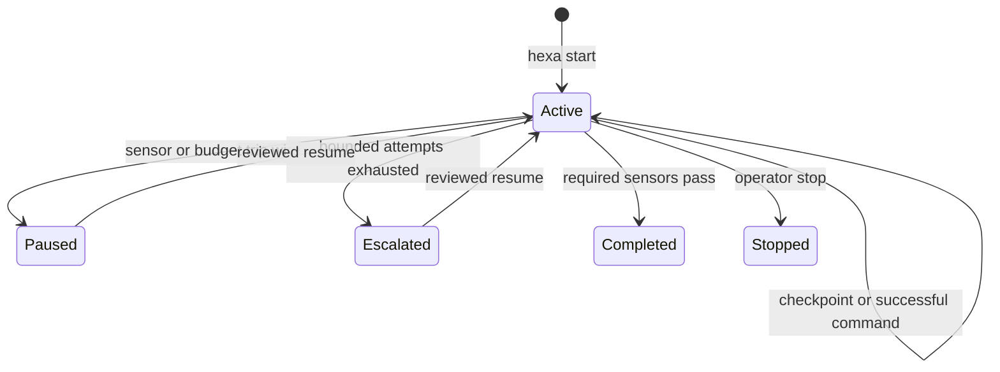

# Operations

## Task lifecycle

`hexa complete` is the only ordinary path to `completed`; it reruns required sensors. A timeout or
failed bounded command retains output and creates an escalation packet instead of hiding partial
failure behind a fluent summary.

## Exit codes

| Exit | Meaning |
|---:|---|
| 0 | Command or sensor succeeded |
| 1 | Executed work or verification failed |
| 2 | Invalid input, deny decision, missing state, or configuration failure |
| 3 | Action requires explicit approval |

## Audit maturity

`hexa audit` separates structural failures from evidence still being accumulated. A new harness can
be structurally sound while warning that it lacks five real failure-derived rules or three real
unattended successes. `hexa audit --strict` treats those warnings as failures for release gates.
